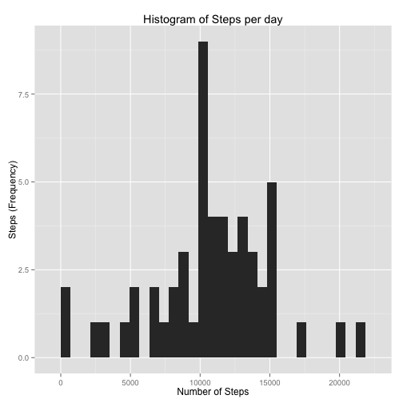
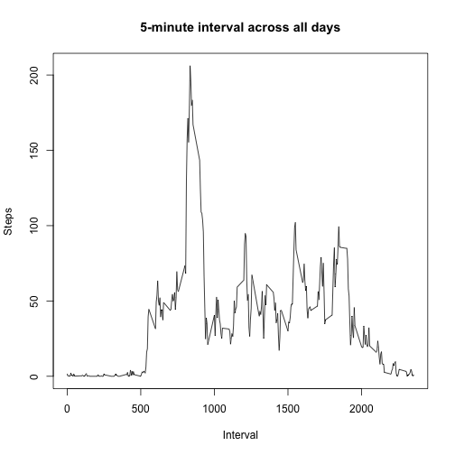
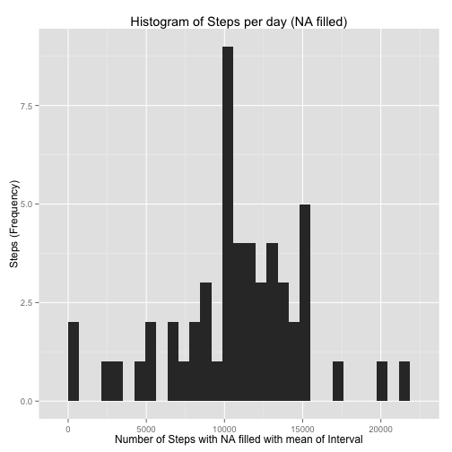

# Reproducible Research: Peer Assessment 1

## Echo Global option TRUE

```r
## Echo Global option TRUE for all Markdown R
library("knitr")
opts_chunk$set(echo = TRUE)
```

## Loading and preprocessing the data
####1.Load the data (i.e. read.csv())


```r
unzip(zipfile="activity.zip")
data_raw <- read.csv("activity.csv", header = TRUE, sep = ",", 
                 colClasses = c("numeric", "character","integer"),
                 na.strings = "NA")
```

####2.Process/transform the data (if necessary) into a format suitable for your analysis


```r
## Removing Na
data <- na.omit(data_raw)
```

## What is mean total number of steps taken per day?
####1.Calculate the total number of steps taken per day

```r
sumsteps <- aggregate(list(steps=data$steps), by=list(date=data$date),
                      FUN="sum")
```

####2.If you do not understand the difference between a histogram and a barplot, research the difference between them. Make a histogram of the total number of steps taken each day


```r
library(ggplot2)
qplot(sumsteps$steps, geom="histogram", 
      binwidth = (max(sumsteps$steps) - min(sumsteps$steps))/30,
      xlab = "Number of Steps",
      ylab = "Steps (Frequency)",
      main = "Histogram of Steps per day") 
```

 

####3.Calculate and report the mean and median of the total number of steps taken per day


```r
mean_na <-mean(sumsteps$steps)
print(mean_na)
```

```
## [1] 10766.19
```

```r
median_na <-median(sumsteps$steps)
print(median_na)
```

```
## [1] 10765
```

##What is the average daily activity pattern?

####1.Make a time series plot (i.e. type = "l") of the 5-minute interval (x-axis) and the average number of steps taken, averaged across all days (y-axis)


```r
data.inter <- aggregate(list(steps=data$steps), by=list(interval=data$interval),
                      FUN="mean")
plot(data.inter$interval,data.inter$steps, type = "l",
     xlab="Interval", ylab="Steps",
     main = "5-minute interval across all days")
```

 

####2.Which 5-minute interval, on average across all the days in the dataset, contains the maximum number of steps?


```r
data.inter[which.max(data.inter$steps),]
```

```
##     interval    steps
## 104      835 206.1698
```

##Imputing missing values

####1.Calculate and report the total number of missing values in the dataset (i.e. the total number of rows with NAs)


```r
sum(is.na(data_raw$steps))
```

```
## [1] 2304
```

####2.Devise a strategy for filling in all of the missing values in the dataset. The strategy does not need to be sophisticated. For example, you could use the mean/median for that day, or the mean for that 5-minute interval, etc.


```r
data_na <- is.na(data_raw$steps)
data_avg <- tapply(data_raw$steps, data_raw$interval, mean, simplify=TRUE, na.rm=TRUE)
```

####3.Create a new dataset that is equal to the original dataset but with the missing data filled in.


```r
data_new <- data_raw
data_new$steps[data_na] <- data_avg[as.character(data_raw$interval[data_na])]
```

####4.Make a histogram of the total number of steps taken each day and Calculate and report the mean and median total number of steps taken per day. Do these values differ from the estimates from the first part of the assignment? What is the impact of imputing missing data on the estimates of the total daily number of steps?


```r
sumsteps_new <- aggregate(list(steps=data_new$steps), by=list(date=data_new$date),
                      FUN="sum")
library(ggplot2)
qplot(sumsteps$steps, geom="histogram", 
      binwidth = (max(sumsteps$steps) - min(sumsteps$steps))/30,
      xlab = "Number of Steps with NA filled with mean of Interval",
      ylab = "Steps (Frequency)",
      main = "Histogram of Steps per day (NA filled)") 
```

 

```r
mean_new <- mean(sumsteps_new$steps)
print(mean_new)
```

```
## [1] 10766.19
```

```r
median_new <- median(sumsteps_new$steps)
print(median_new)
```

```
## [1] 10766.19
```


```r
mean_new - mean_na
```

```
## [1] 0
```

```r
median_new - median_na
```

```
## [1] 1.188679
```
Almost no difference as we used the mean to fill the NA, implying that we add values with no weight

##Are there differences in activity patterns between weekdays and weekends?
Not done
